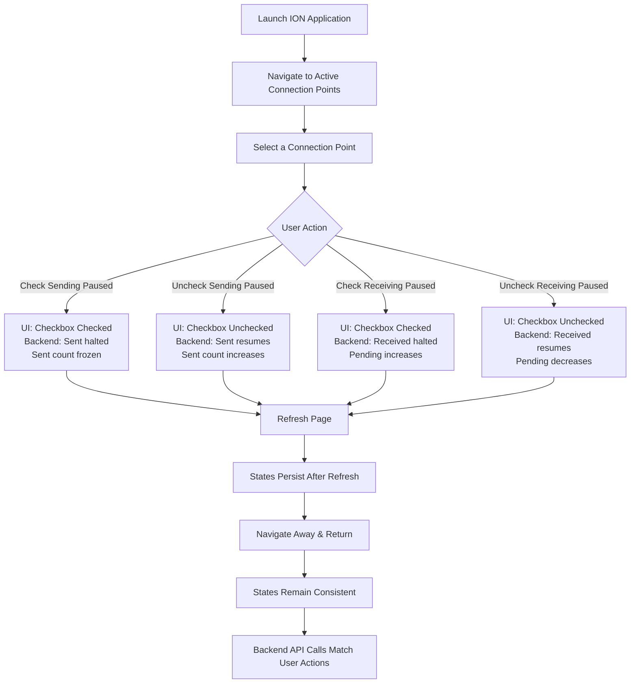

# 📊 Visual Flow – Active Connection Points Pause/Resume

# Visual Scenario-Based Test Design  
**Feature:** Active Connection Points – Pause/Resume Functionality  

---

## 🎯 Objective
- Validate the stability and persistence of **Sending Paused** and **Receiving Paused** checkboxes.  
- Ensure UI actions (pause/resume, refresh, navigation) are consistently reflected in the backend API and runtime counters.  
- Confirm that rapid or repeated user interactions do not cause mismatched states or duplicate API calls.  

---

## 📦 Scope
- **In-Scope:**  
  - UI validation of pause/resume checkboxes.  
  - Backend API call verification.  
  - Runtime counters (Sent, Received, Pending).  
  - Page refresh and navigation consistency.  
- **Out-of-Scope:**  
  - Non-ION connectors.  
  - Performance benchmarking beyond pause/resume flows.  
  - Security or authentication testing.  

---

## 📊 Test Data
- **Connection Points (CPs):**  
  - Enterprise Connector CP  
  - Network CP  
  - File CP  
  - Stream CP  
  - sFTP via Cloud CP  

- **States:**  
  - Active  
  - Paused (Sending/Receiving)  
  - Pending  

- **Counters:**  
  - Sent  
  - Received  
  - Pending  
  - No Route  

- **Actions:**  
  - Pause  
  - Resume  
  - Refresh  
  - Navigate Away/Return  

- **Backend Verification:**  
  - API calls via DevTools  
  - Ensure no duplicate or conflicting calls  
  - Counters align with checkbox states  

